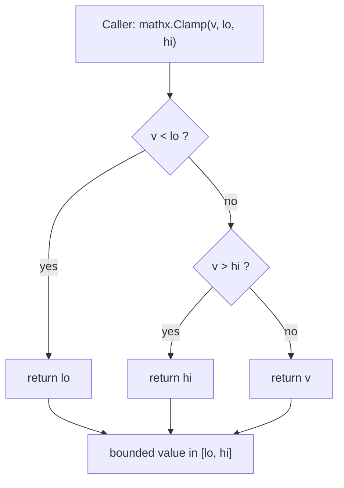

# Add `mathx.Clamp` — bound an integer to an inclusive range

## What this milestone delivers

This milestone introduces `mathx`, a tiny, dependency-free helper package at the
root of the `mathxlive` module. It exposes a single, purpose-built primitive —
`Clamp` — that constrains an integer to an inclusive `[lo, hi]` range. Values
below the lower bound snap up to `lo`, values above the upper bound snap down to
`hi`, and values already inside the window pass through unchanged.

## Why

Clamping is one of the most frequently re-derived one-liners in application
code: normalizing user input, keeping cursor or scroll positions on screen,
squeezing sensor readings into a display band, or capping retry counts. Each
ad-hoc re-implementation is a place for an off-by-one or a flipped comparison to
hide. Providing one well-tested, allocation-free `Clamp` gives callers a single
obvious, correct choice and removes that whole class of small bugs.

The contract is deliberately **minimal and complete**: three boundary behaviors,
no speculative edge cases, no generics, no extra surface area. That keeps the
package trivial to reason about and trivial to trust.

## Design & flow

## How it is verified

The milestone follows a test-first (TDD) flow. The public contract is pinned by
two protected tests that must pass without modification:

- a **unit contract test** asserting the three boundary cases
  (`Clamp(5,0,10)==5`, `Clamp(-1,0,10)==0`, `Clamp(99,0,10)==10`), and
- an **end-to-end test** exercising a realistic use case: clamping an entire
  slice of raw values into a fixed window and checking the result element by
  element.

At assign time the suite is intentionally **RED** — the implementation is added
in a later step so that `go test ./...` turns **GREEN** purely by supplying the
function, with the tests left untouched.
