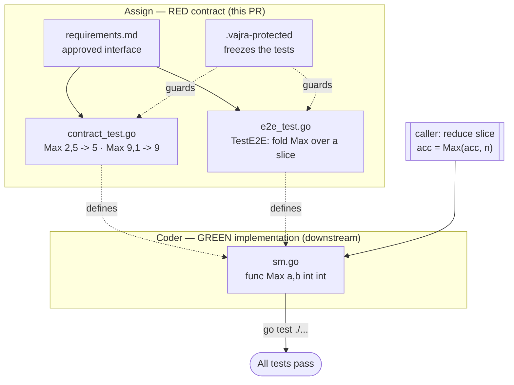

# Add `sm` package with `Max` to module `smlive`

## What this milestone delivers
This milestone introduces a small, self-contained integer utility package,
`sm`, at the root of the `smlive` module. It exposes a single approved public
function, `Max(a, b int) int`, which returns the larger of two integers. The
package has no dependencies beyond the standard library and is designed to be a
dependable primitive that callers can fold over collections to compute maxima.

## Why
Comparing two integers and keeping the larger is a ubiquitous building block —
running maxima, clamping, bounds checks. Centralising it in one reviewed,
tested function removes ad-hoc `if a > b` duplication across callers and gives
us a single place to guarantee correctness.

## Approach (test-driven milestone)
The contract is locked down *before* any production code exists:

- **`requirements.md`** states the approved interface and every requirement.
- **`contract_test.go`** pins the unit-level behaviour (`Max(2,5)==5`,
  `Max(9,1)==9`).
- **`e2e_test.go`** exercises a realistic end-to-end scenario: reducing a slice
  of integers to its maximum by folding `Max` across it.
- **`.vajra-protected`** freezes the two test files so downstream work cannot
  weaken the contract.

At this assign step there is deliberately no implementation (`sm.go` is absent),
so `go test ./...` is RED. Downstream, the coder adds `sm.go` to turn the suite
GREEN without touching any protected file, and the summarizer reports the
result.

## Design / flow

## Not included
Variadic/generic maxima, floats, and empty-slice handling are out of scope; the
caller seeds the fold with the first element.
